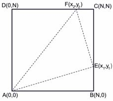

# The 2008 Asia Regional Contest - Dhaka

<table>
<thead>
<th width='40px' align='center'>Id</th>
<th width='500px' align='left'>Problem</th>
<th width='130px' align='left'>Link</th>
<th width='80px' align='left'>Code</th>
</thead>
<tbody>
<tr><td>A</td>   <td>Find the Format String</td>   <td>LA 4200</td>   <td><a href='4200.cpp'>C++</a></td>   </tr>
<tr><td>B</td>   <td>Switch Bulbs</td>   <td>LA 4201</td>   <td><a href='4201.cpp'>C++</a></td>   </tr>
<tr><td>C</td>   <td>Schedule of a Married Man</td>   <td>LA 4202</td>   <td><a href='4202.cpp'>C++</a></td>   </tr>
<tr><td>D</td>   <td>Puzzles of Triangles</td>   <td>LA 4203</td>   <td><a href='4203.cpp'>C++</a></td>   </tr>
<tr><td>E</td>   <td>Chemical Plant</td>   <td>LA 4204</td>   <td><a href='4204.cpp'>C++</a></td>   </tr>
<tr><td>F</td>   <td>Clicking Checkboxes</td>   <td>LA 4205</td>   <td></td>   </tr>
<tr><td>G</td>   <td>Magic Rings</td>   <td>LA 4206</td>   <td><a href='4206.cpp'>C++</a></td>   </tr>
<tr><td>H</td>   <td>Line Chart</td>   <td>LA 4207</td>   <td></td>   </tr>
<tr><td>I</td>   <td>Mobile Tower</td>   <td>LA 4208</td>   <td></td>   </tr>
<tr><td>J</td>   <td>Stopping Doom's Day</td>   <td>LA 4209</td>   <td><a href='4209.cp'>C++</a></td>   </tr>
</tbody>
</table>

## Problem A. Find the Format String

##### Solution
直接模拟即可。注意一些特殊情况。

全部字母数字都禁止出现，无答案。

输出比输入长，无答案。

"3333" "33"这种情况。

注意理解字典序最小。

等等等等。 

## Problem B. Switch Bulbs

##### Solution
首先进行预处理，建立一个图。图的每个顶点代表灯泡的状态，用二进制的0和1表示某个位的灯泡的亮与灭。然后根据给出的开关，在图上建边，最后从0 顶点开始BFS，预处理出0到其它所有顶点的最短路径，即可快速回答询问。 

## Problem C. Schedule of a Married Man

##### Solution
直接判断即可。 

## Problem D. Puzzles of Triangles

##### Summary

给出一个N × N的正方形，问有多少种方法，如图，将其分解成四个直角三角形。 

##### Solution

如图，若只考虑中间的之间三角形的其中一个锐角在A，且FC&lt;CE，答案为ans，那么最终答案就是ans*8。

设：FC=b,CE=a,EB=d,FD=c，根据勾股定理和各个等量关系，能够得出：

a2/N=a-b。

题目要求所有数字都是整数，且明显，a&lt;N。那么将N分解质因数，若a2 mod N = 0，那么必有：如果N=p1e1p2e2p3e3..pkek，那么最小的a必为：

mina = p1(e1+1)/2p2(e2+1)/2p3(e3+1)/2..pk(ek+1)/2

指数之中的除法是整除。

那么mina, 2mina, 3mina...(N/mina)mina都是符合要求的。这时方案数为：ans=N/mina-1。

## Problem E. Chemical Plant

##### Solution

题目的意思比较复杂，尽量将题目多看几次。

解决这个问题的做法是重新拆点，重新建图，然后使用最短路算法解决。

对于每个点，例如点x，如果有连向x的边，在时间内t1,t2,t3...tk到达，那么就把点x拆成k个点，那么最短路的状态就可以表示 为：在ti时间内到达点x，损耗最小的物质数量。之后就建图，注意控制新建的图的边数量。

对于第一个sample：

<pre>
3 6 50
2 50
1 2 0 10 20 30
1 2 5 6 9 11
2 3 13 15 25 28
3 3 32 33 40 45
3 1 30 31 39 40
1 2 41 42 48 49
</pre>

拆成8个点：
<pre>
pit 1 time 0   newid 1
pit 1 time 40   newid 2
pit 2 time 11   newid 3
pit 2 time 30   newid 4
pit 2 time 49   newid 5
pit 2 time 50   newid 6
pit 3 time 28   newid 7
pit 3 time 45   newid 8
</pre>
比起现有的六条边，多了一个起点pit 1 time 0，和终点pit 2 time 50。这个也是最短路的起点和终点。

新图中的边：

<pre>
1 4 cost 20
1 3 cost 8
3 7 cost 7
7 8 cost 10
7 2 cost 4
2 5 cost 3
...
1 2 cost 40
3 4 cost 19
4 5 cost 19
5 6 cost 1
7 8 cost 17
</pre>
上半部分的边是不同的pit之间的连边。下半部分的边是同一个pit，不同时间之间的节点的连边。对于一个pit的一个时间，只有一条边连进去。这 条连进去的边，是时间上最靠后且满足题目要求的。也就是说，例如，在2号pit，有3条边到达3号pit，一条到达的时间是11，一条到达的时间是12， 一条到达的时间是13，而从3号pit到4号pit有一条边，最早出发时间为15，最迟到达时间为20。那么按道理从3号pit的所有时间状态，到达4号 pit的20时间，都应该有边。但是这样连边的话，会产生很多边。正确的连边方法是：3号pit时间11向3号pit时间12连边，3号pit时间12向 3号pit时间13连边，只有3号pit时间13向4号pit时间20连边。

具体的连边规则请看代码，注意正确计算时间耗费。在最短路算法的过程中，如果算到耗费大于给出的W，就不能从这个状态继续扩展下去。 

## Problem G. Magic Rings

##### Summary
给出平面上N个点，要求用最多K个圆覆盖这些点，使半径最大的圆最小。(N<19)
##### Solution
这个题目可以先二分一个半径R，然后转化为判定能否使用半径为R的圆覆盖这些点。考虑到，如果以P为圆心，半径为R的圆能够覆盖点Q，那么反过来， 以Q为圆心，R为半径的圆也能够覆盖点P。因此，我们可以两两枚举给出的点，求以这些点为圆心，R为半径的圆之间的交点，然后再用这些交点作为圆心，R为 半径，覆盖给出的点。这样就是一个经典的“重复覆盖模型”。由于点很多，因此普通的搜索很难在时限内出解。重复覆盖模型可以使用Dancing Link+启发函数的方法解决。 

##### Thanks
FreeOpen & Liu Yang

## Problem J. Stopping Doom's Day

##### Solution
查阅得：这是一个关于n的十次多项式f(n)。

得知是十次多项式后，可以使用拉格朗日插值法，求出原来的f(n)。之所以用拉格朗日插值，是因为处理分数比较方便。求出后，由于系数带有 分数，而且要求模，因此，需要使用数论中的乘法逆元处理。 

