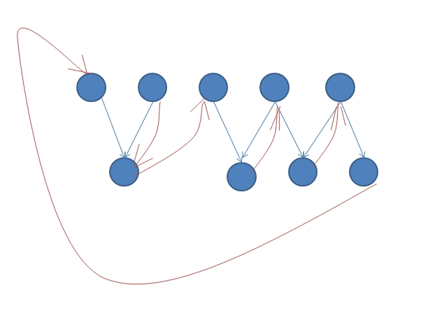

# The 2008 Northwestern Europe Regional Contest

<table>
<thead>
<th width='40px' align='center'>Id</th>
<th width='500px' align='left'>Problem</th>
<th width='130px' align='left'>Link</th>
<th width='80px' align='left'>Code</th>
</thead>
<tbody>
<tr><td>A</td>   <td>Equilibrium Mobile</td>   <td>LA 4286</td>   <td><a href='4286.cpp'>C++</a></td>   </tr>
<tr><td>B</td>   <td>Proving Equivalences</td>   <td>LA 4287</td>   <td><a href='4287.cpp'>C++</a></td>   </tr>
<tr><td>C</td>   <td>Cat vs. Dog</td>   <td>LA 4288</td>   <td><a href='4288.cpp'>C++</a></td>   </tr>
<tr><td>D</td>   <td>Disgruntled Judge</td>   <td>LA 4289</td>   <td><a href='4289.cpp'>C++</a></td>   </tr>
<tr><td>E</td>   <td>Easy Climb</td>   <td></td>   <td></td>   </tr>
<tr><td>F</td>   <td>Sculpture</td>   <td>LA 4291</td>   <td><a href='4291.cpp'>C++</a></td>   </tr>
<tr><td>G</td>   <td>Matchsticks</td>   <td>LA 4292</td>   <td><a href='4292.cpp'>C++</a></td>   </tr>
<tr><td>H</td>   <td>White Water Rafting</td>   <td>LA 4293</td>   <td><a href='4293.cpp'>C++</a></td>   </tr>
<tr><td>I</td>   <td>Shuffle</td>   <td></td>   <td></td>   </tr>
<tr><td>J</td>   <td>Videopoker</td>   <td></td>   <td></td>   </tr>
</tbody>
</table>

## Problem A. Equilibrium Mobile

##### Summary
给出一个天平，天平的结构类似一个二叉树。问要使天平的每一层都平衡，至少要改变多少个砝码。 
##### Solution

1. 先观察同一层的情况：例如数据\][\][2,2],\][2,3]]，那么明显只要把重量为3的那个砝码改变成2就可以了。也就是说，尽量往最多的那个数字改。

2. 观察相隔一层的情况：例如数据\][\][2,3],4]，明显，只需要把重量为3的那个砝码改变成2就可以了。因为4是2的两倍。而2又是在4的下一层。如果有两个2，恰好能够与4平衡。

3. 再观察数据\][48,\][24,\][12,\][\][2,2],\][2,3]]]]]，答案是3，只要将下面的3个2全部改变成3即可。注意到数据中，48是下一层24的两倍，24又是其下一层的12的两倍，而12又是下两层3的4倍。我们定义这为一个“系”。同一个“系”是等价的。我们就是要把所 有的数字往节点最多的那个“系”改。如果对于层数为d1，重量为w1的砝码，如果另一个砝码层数为d2，重量为w2，如果2d1w1=2d2w2， 那么这两个砝码就在同一个“系”中。

在具体代码中，可以使用map来记录这个关系。 

## Problem B. Proving Equivalences

##### Summary
有一个有N个顶点的有向图(N<=20000)，问：至少添加多少条边，使整个有向图为一个强连通分量。 
##### Solution

首先对原来的有向图进行求强联通分量缩点，之后得到一个有向无环图（可能有多个连通块）。统计缩点后每个点的入度和出度情况。设入度为0的点数为 ind个，出度为0的点数为outd个，那么答案就是max(ind, outd)。

之所以是这样，是因为我们可以在一个有向无环图中加边，使其成为强连通分量。下图给出一种比较普遍的情况：

蓝色的是缩点后的边，红色的是新加的边。加边思想就是：要让这些边连成一个环，将整个图“串通”起来。 

## Problem C. Cat vs. Dog

##### Solution
可以转化成一个二分图模型。两两枚举人，处理出他们之间是否有矛盾，有则在二分图上面连边。在二分图中，最大独立集＝N-最大匹配数。因此使用最大 匹配算法可以解决。 

## Problem D. Disgruntled Judge

##### Solution
按照题目的意思，随机生成a和b，然后判断。一旦不符合就break。 

## Problem F. Sculpture

##### Summary
给出N（N<=50）个立方体，问这些立方体交的体积与表面积。如果某些空间被立方体完全包含，则也要计算体积。表面积则计算最外面的。 
##### Solution
由于被立方体完全包含的空间也要计算体积，因此不能直接套用常规的立方体切割或线段树之类的方法做。由于题目给出的N很小，因此可以先离散化，然后 使用一个100\*100\*100的数组进行填充。floodfill外部的空间之后，就可以很方便地计算没有被立方体包含的体积和外部的表面积。 

## Problem G. Matchsticks

##### Summary
给出n根火柴，求用这些火柴能拼出最小的和最大的数字。火柴的数字表示方法和液晶数字显示的方式相同。

##### Solution
要尽量让数字大的话，明显就应该增大其位数。易得最大的数字尽量用1和7，这个构造比较简单。

最小的数字的话有点麻烦。官方题解给出了方法，但是并没有解释原因，标程也写得莫名其妙。我用了一种类似动态规划的方法来构造答案。

用minAns[n]表示用n个火柴，能够得到最小的数字（用字符串表示比较方便）。明显，n=2到n=8时的答案分别是1, 7, 4, 2, 6, 8, 10。

用minAns0[n]表示用n个火柴，能够得到最小的数字（同样用字符串表示比较方便）。但这里的允许数字有前置0。此外，最小的定义是：先是长度最小。长度相同的情况下，数字最小。例如：88优于008，08优于10。

状态转移为：
<pre>
minAns[num] = min(minAns[i] + minAns0[num - i]), 2<=i<=7

minAns0[num] = min(minAns0[i] + minAns0[num - i]), 2<=i<=7
</pre>
这个转移意思就是，当前最小的数字，必定是由其前面7个数字，放上新的最高位组成的。第一个转移不允许有前置0，而第二个转移可以。

## Problem H. White Water Rafting

##### Solution

计算几何。

可以转化为点到线段的距离，枚举外层的各点，求到内层各线段的距离。再枚举内层各点，求到外层各线段的距离。取距离所有的最小值除2即可。 

