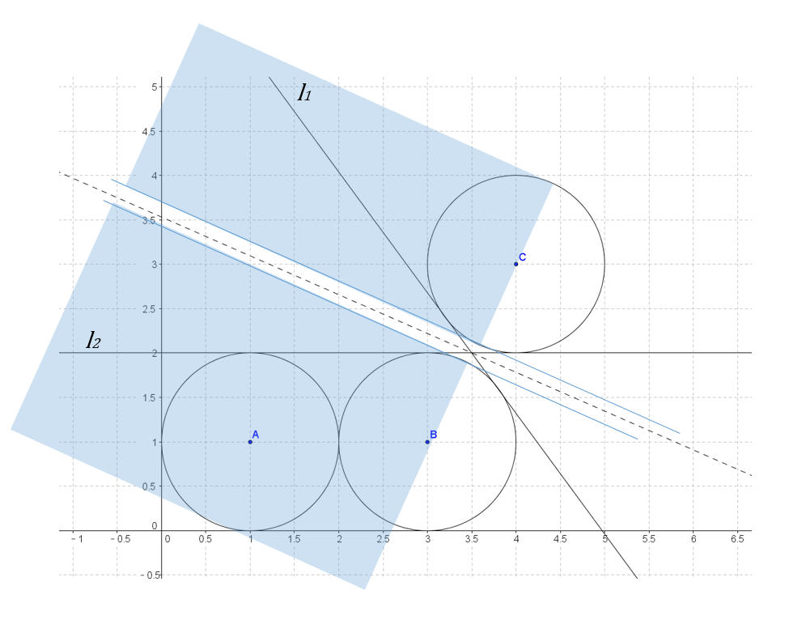

# 2006 Nationwide Internet Contest (Japan Domestic Contest) 
<table>
<thead>
<th width='40px' align='center'>Id</th>
<th width='500px' align='left'>Problem</th>
<th width='130px' align='left'>Link</th>
<th width='80px' align='left'>Code</th>
</thead>
<tbody>
<tr><td>A</td>   <td>Dirichlet's Theorem on Arithmetic Progressions</td>   <td></td>   <td></td>   </tr>
<tr><td>B</td>   <td>Organize Your Train part II</td>   <td></td>   <td></td>   </tr>
<tr><td>C</td>   <td>Hexerpents of Hexwamp</td>   <td></td>   <td></td>   </tr>
<tr><td>D</td>   <td>Curling 2.0</td>   <td></td>   <td></td>   </tr>
<tr><td>E</td>   <td>The Genome Database of All Space Life</td>   <td><a href='http://poj.org/problem?id=3010'>POJ 3010</a></td>   <td><a href='poj3010.cpp'>C++</a></td>   </tr>
<tr><td>F</td>   <td>Secrets in Shadows</td>   <td><a href='http://poj.org/problem?id=3011'>POJ 3011</a></td>   <td><a href='poj3011.cp'>C++</a></td>   </tr>
</tbody>
</table>

## Problem E. The Genome Database of All Space Life
OJ and Id							| Language	| Status        | Run Time / Limit            |
-----------------------				| --------	| ------------- | -------------               |
POJ 3010							| C++		| Accepted      | 32 ms / 1000 ms 		  	  |
##### Solution
(略)

## Problem F. Secrets in Shadows

OJ and Id							| Language	| Status        | Run Time / Limit            |
-----------------------				| --------	| ------------- | -------------               |
POJ 3011							| C++		| Accepted      | 829 ms / 10000 ms 		  |
Aizu OJ 1146						| C++		| Accepted		| 0.12 s / 8 s           	  |

##### Summary
平面上有n(n\<=100)个圆柱，半径均为1。光线以某个角度照射这些圆柱，投射出一系列阴影，这些阴影的总长度为w。现在求两个角度：θmin和θmax，分别使阴影的宽度最小和最大。

##### Solution

计算几何+数学。

这个题目有一定难度。我是看了一份代码很久之后才理解其思路。

令函数f(θ)表示旋转平面θ后得到的投影的宽度。虽然这个题目求的是最小值和极大值，f(θ)是一个连续函数，但并不是一个可导函数。在不同角度，有的圆的投影时而重合，时而分开。所以我们无法用一个统一的函数来表示这个宽度并直接求极值。

但是仔细观察以后，我们会发现，假设平面在不停旋转，所有圆和圆的阴影的重合和分离事件，都是在旋转到两个圆的<b>公切线</b>时发生的。以题目第一个Sample为例（见图1），圆B和圆C的内公切线分别是l1和l2。在l1和l2之间的旋转角度，圆AB和圆C的阴影是分离的。其他旋转角度的话，圆AB和圆C的阴影是重合的。切线l1和l2就是发生这种变化的地方。

如果在旋转角度区间[θ1, θ2]之间，阴影没有发生重合和分离事件，其宽度是可以用一个确定的函数表示的（这个函数之后会讲述怎么求）。也就是说，f(θ)是一个分段函数，每一个子函数的的区间θ1, θ2是两个圆公切线的切线角度。所以题目的第一步就是把任意两圆之间的公切线求出来。把这些切线和x轴的夹角求出来，对夹角排序，这样就把[0, π]分成许多小区间。f(θ)在某个区间[θ1, θ2]里面，必定是一个单调或者单峰函数，我们就可以求出所有区间的极大值和极小值。

于是下一步就是，在某区间[θ1, θ2]，如何求这些圆的阴影宽度，以及其极大值和极小值。

如图2，首先，我们取θ1, θ2之间的一个角度（例如a=(θ1, θ2) / 2）。把整个平面旋转a。我们定义重合集为所有阴影重叠在一起的圆的几何。图2里面有两个重合集：AB和C。每个重合集里面，阴影的宽度由最上面的和最下面的两个圆心决定：ymax - ymin + 2.0（ymax是重合集最上面的圆心的y坐标，ymin是最下面的的圆心y坐标）。在[θ1, θ2]之间，圆的上下关系是不会发生变化的。所以我们只关心每个重合集里面最上面的和最下面的两个圆心A和B。设θ在[θ1, θ2]之间，在平面旋转θ之后，重合集的阴影长度Wi为：

Wi = (xA - xB) \* sin(θ) + yA - yB) \* cos(θ) + 2。（意思就是把两个圆心连成向量v，旋转θ，阴影长度就是v在y轴上的投影）。

所有重合集的阴影总宽度为题目所求。该宽度是W = sum (Wi = (xAi - xBi) \* sin(θ) + yAi - yBi) \* cos(θ) + 2)。

把上式表示为：

f(θ) = A sin(θ) + B cos(θ) + c, θ1 \< θ \< θ2。我们需要知道使这个函数的极值时的θ。设此时θ=t。

求导得：df(θ)/dθ = A cos(θ) - B sin(θ)

要求极值的话，需要解：A cos(t) - B sin(t) = 0

稍加推导，得：a / b = tan t

t = atan(a / b)。如果t不在[θ1, θ2]之间的话，就忽略。

那么在[θ1, θ2]之间，函数可能取极值的地方，就分别是θ1，θ2或者t。分别计算在这三个角度时阴影的宽度即可。对分段函数f(θ)所有区间求极值，即可求出全局最大值和最小值。

