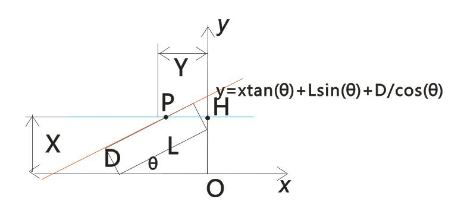

# The 2008 Asia Regional Contest - Harbin Preliminary

<table>
<thead>
<th width='40px' align='center'>Id</th>
<th width='500px' align='left'>Problem</th>
<th width='130px' align='left'>Link</th>
<th width='80px' align='left'>Code</th>
</thead>
<tbody>
<tr><td>A</td>   <td>Turn the corner</td>   <td><a href='http://acm.hdu.edu.cn/showproblem.php?pid=2438'>HDU 2438</a></td>   <td><a href='hdu2438.cpp'>C++</a></td>   </tr>
<tr><td>B</td>   <td>The Mussels</td>   <td></td>   <td></td>   </tr>
<tr><td>C</td>   <td>Watch out the Animal</td>   <td><a href='http://acm.hdu.edu.cn/showproblem.php?pid=2440'>HDU 2440</a></td>   <td><a href='hdu2440.cpp'>C++</a></td>   </tr>
<tr><td>D</td>   <td>ACM(Array Complicated Manipulation)</td>   <td></td>   <td></td>   </tr>
<tr><td>E</td>   <td>Bricks</td>   <td></td>   <td></td>   </tr>
<tr><td>F</td>   <td>Counter Strike</td>   <td><a href='http://acm.hdu.edu.cn/showproblem.php?pid=2443'>HDU 2443</a></td>   <td><a href='hdu2443.cpp'>C++</a></td>   </tr>
<tr><td>G</td>   <td>The Accomodation of Students</td>   <td><a href='http://acm.hdu.edu.cn/showproblem.php?pid=2444'>HDU 2444</a></td>   <td><a href='hdu2444.cpp'>C++</a></td>   </tr>
<tr><td>H</td>   <td>Little White's Explore</td>   <td></td>   <td></td>   </tr>
</tbody>
</table>

## Problem A. Turn the corner

##### Summary

##### Solution
首先要对几何平面建系，我的建系方法如图。接着，由于车的转弯是一个动态过程，我们需要研究的是每一个静态的瞬间，看看是否会被“卡住”。 

如图，在列出红色的那条直线的方程后，关键要求出其与蓝色线交点P。如果交点在y轴的右方，或者交点P在y轴的左方，且PH\<=Y， 那么车在这个瞬间就不会被卡住。想象一下，若P在Y轴的左方，那么PH的长度必定是先增后减，表示为函数的话，PH=f(θ)必定是一个凸性函数。因此我 们只要求出这个函数在(0,PI/2]这个区间中的极值即可。

在y=x tan(θ)+L sin(θ)+D/cos(θ)这条式子中，只要把常量X代进y，反解出x，-x就是PH。求出-x的最值，若 -x\<Y，车就是能够转弯转过去的。

求一个凸性函数的极值，可以使用三分法。 

## Problem C. Watch out the Animal

##### Solution

先求凸包。题目所求的是一个凸包的费马点。多边形的费马点目前没有好的方法。变步长随机化贪心是一种解决这类问题的有效方法。 

## Problem F. Counter Strike

##### Solution
这个题目的模型可以转化为归并求逆序数.根据题目给出的第一个SAMPLE,简述转化步骤:

题目的Sample是:
<pre>
5 3
1 3 7 2 4
</pre>

对于给出的数组A和平均数m,只需要将A中各个数字减去m,那么就题目就转化为找出(i,j)区间的数目，使(i,j)区间的数字的和大于0,得: 

<pre>
-2 0 4 -1 1
</pre>

在数组最后加上一个0,从后面起对数组进行求和,也就是从右面开始执行a[i]=a[i+1]+a[i],设得到的数列名叫B: 
<pre>
2 4 4 0 1 0
</pre>

刚刚说过,题目已经转化为寻找大于0的区间的数目,那么在上面的数列中:sum(i,j)=B[i]-B[j+1].若sum(i,j)>0,那么 B[i]-B[j+1]>0,也就是B[i]>B[j+1].最后,题目转化为,求B序列中的逆序数.求逆序数可以用归并排序的方法在 O(nlgn)的时间内解决. 

## Problem G. The Accomodation of Students

##### Solution

先用染色法判断是否为二分图，然后再求二分图最大匹配。 
