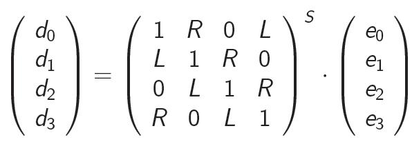

# The 2008 Southweastern Europe Regional Contest

# Problem A. Bring Your Own Horse
## Solution
本题利用了最小生成树的性质。可以证明，所求的边必定在最小生成树上。

先求一次最小生成树，然后根据最小生成树建图，再DFS即可。

# Problem B. First Knight
## Summary
有一个N\*M的方格阵里，有个人要从(1,1)走到(n,m)，且已知他走附近四个格子的概率。问他从(1,1)走到(n,m)的回合数的数学期望是多少。

## Solution

对于每个格子，都有一个等式:
Ei,j=p1Ei-1,j+p2Ei+1,j+p3Ei,j+1+p4Ei,j-1+1

且En,m=0，题目要求的就是E1,1。

对于这个问题，把所有的期望Ei,j当成是未知数，可以列一个有n*m条式子的方程组，使用高斯消元能够解决。但是
朴素的高斯消元方法比较慢，这个题目的等式有特殊性，可以进行优化：

1. 由于题目所求的就是E1,1，因此在给未知数编地址的时候可以反转过来编，这样就避免了O(n^2)的回代。
2. 把所有系数列成矩阵后发现第i行max(0,i-m)至min(m*n,i+m)这些位置有数字。列也是如此。如果高斯消元时不进行选
取主元，那么可以发现每次向下和向右消去时只需要消m+1个式子与未知数即可。这样复杂度由原来的O(m^3n^3)变为O(m^3n)。

# Problem C. Postal Charges
## Solution
先将各个点按照其所属的区间分开，然后在各个区间选出一个“代表点”，计算各个代表点的距离。然后统计路径数目，最后统计路径长度。

# Problem D. Randomly-priced Tickets
## Solution
先使用floyd求出最短路，然后使用DP计算概率。

# Problem E. The Game
# Problem F. Merchant Guild

# Problem G. Toll Road
## Solution
简单的树形DP。 

# Problem H. Top Secret
## Solution
对于这个题目，可以构造矩阵，进行乘法解决。矩阵的构造方法为：

使用矩阵乘法解决。由于题目所给的s很大，因此需要使用矩阵快速幂。但是，由于n也很大，达到1000，因此，光有矩阵快速幂的优化是不足够的。观察这个矩阵可以发现这个矩阵有一个很特殊的性质，每一行，都是前一行向右偏移一个位置得到的。因此，可以利用这个性质来优化矩阵乘法，使O(n3)的矩阵乘法的复杂度降为O(n2)。

线性代数知识：在线性代数中，循环矩阵是一种特殊形式的[Toeplitz Matrix](http://en.wikipedia.org/wiki/Toeplitz_matrix)，它的行向量的每个元素都是前一个行向量各元素依次右移一个位置得到的结果。

循环矩阵遵循代数运算法则。对于两个循环矩阵A 与 B来说，A + B 也是循环矩阵。AB也是循环矩阵，并且AB = BA。因此可以使用优化的矩阵乘法解决：每次只运算得到矩阵的第一行，就相当于得到了整个矩阵。

对于一个循环矩阵，取M\[a,b\]为：M\[(b-a+n)%n\]。

有了上面的优化，时间复杂度为O(n2)，空间复杂度为O(n)。

# Problem I. Transcribed Books
## Solution
若a mod N = b，易得(a-b) mod N = 0。对于每组数据，用max保存最大的a10。对于每十个数字，x=sum(a1至a9)减去a10。计算所有x最大公约数。如果gcd<=1或gcd<=max，那么则无解。否则这个gcd就是答案。

# Problem J. Wizards
## Summary
给出一个n次多项式f(x)(n<=10),问这个f(x)=0是否有n个不同的根,复数,实数根都算.
## Solution
定义:f'(x)是f(x)的导数,那么如果gcd(f'(x),f(x))不是常数(也就是度为0的多项式),那么就有n个根.

求gcd可以使用扩展的欧几里德算法,对多项式进行求模和除法.但是更加简便的方法是使用[Sylvester matrix](http://en.wikipedia.org/wiki/Sylvester_matrix)矩阵行列式的秩判断.
